# USER MANUAL
This document describes the major features of the app and how to use them.

## SECTION A: Dashboard Users
Dashboard users are the administrators of the app who can manage users, roles, permissions, CSOs and other aspects of the app.

### Dashboard landing and statistics
The dashboard landing page shows an overview of the app's performance and statistics, such as the number of users, CSOs, and experts. You can access the dashboard landing page by logging in with your dashboard credentials, or by clicking on the title found at the top left corner of the dashboard page.

### Managing Users

You can view, edit, delete and create users from the Users page. To access the Users page, click on the Users link in the navigation bar.

On the Users page, you can see a table with all the users in the app. You can use the table filters to filter the users by name, or email. You can also use the pagination buttons to navigate through the pages of users.

To edit a user, click on menu button then the Edit button next to their name. This will open a page  where you can change their name, email, password, and role. To save your changes, click on the Update button.

To delete a user, click on the Delete button in the menu next to their name. This will open a confirmation dialog where you have to agree in order to proceed.

To create a new user, click on the Add button at the top right of the Users page. This will open a page where you have to enter their name, email, password and role. To create the user, click on the Save button.

### Roles and Permissions

You can manage the roles and permissions of the app from the Roles page. To access the Roles page, click on the Roles link in the navigation bar.

On the Roles page, you can see a table with all the roles in the app. You can use the filter to filter the roles by name. You can also use the pagination buttons to navigate through the pages of roles.

To edit a role, click on its name. This will open a page where you can change its name, slug and permissions. To save your changes, click on the Update button.

To delete a role, click on the Delete button found in the edit page.

To create a new role, click on the Create Role button at the top of the Roles page. This will open a page where you have to enter its name, slug and permissions. To create the role, click on the Save button.

### Managing CSOs
You can view, edit, delete and create CSOs from the CSOs page. To access the CSOs page, click on the CSOs link in the navigation bar.

On the CSOs page, you can see a table with all the CSOs in the app. You can use the filter to filter the CSOs by name. You can also use the pagination buttons to navigate through the pages of CSOs.

To edit a CSO, click on the Edit button in the menu button next to its name. This will open a page where you can change its name, category, location, description, logo and status. To save your changes, click on the Update button.

To delete a CSO, click on the Delete button next to its name. This will open a confirmation dialog where you have to click on Yes to confirm your action.

To create a new CSO, click on the Create CSO button at the top of the CSOs page. This will open a page where you have to enter all its information. To create the CSO, click on the Save button.

### Managing articles
You can view, edit, delete and create articles from the articles page. To access the articles page, click on the articles link in the navigation bar.

On the articles page, you can see a table with all the articles in the website. You can use the filters to filter the articles by name and category. You can also use the pagination buttons to navigate through the pages of articles.

To edit an article, click on the Edit button in the menu button in the article row. This will open a page where you can change its title, excerpt, author, cateory, tags, content and image. To save your changes, click on the Update button.

To delete an article, click on the Delete button next to its title. This will open a confirmation dialog where you have to confirm your action.

To create a new article, click on the Create article button at the top right of the articles page. This will open a page where you have to enter its title, excerpt, author, cateory, tags, content and image. To create

### Managing articles categories

You can manage the categories of the articles from the Articles categories page. To access the Categories page, click on the Article categories link in the navigation bar.

On the Categories page, you can see a table with all the categories in the app. You can use the filterx to filter the categories by name. You can also use the pagination buttons to navigate through the pages of categories.

To edit a category, click on the Edit button next to its name. This will open a page where you can change its name. To save your changes, click on the Update button.

To delete a category, click on the Delete button next to its name. This will open a confirmation dialog where you have to confirm your action.

To create a new category, click on the Create Category button at the top right of the Categories page. This will open a modal window where you have to enter its name and description. To create the category, click on the Save button.

### Managing events
You can view, edit, delete and create events from the events page. To access the events page, click on the events link in the navigation bar.

On the events page, you can see a table with all the events in the website. You can use the filters to filter the events by name. You can also use the pagination buttons to navigate through the pages of events.

To edit an event, click on the Edit button in the in the event row. This will open a page where you can change its name, type, image, date, time and description. To save your changes, click on the Update button.

To delete an event, click on the Delete button next to its title. This will open a confirmation dialog where you have to confirm your action.

To create a new event, click on the Create Event button at the top right of the Events page. This will open a page where you have to enter its name, type, image, date, time, and description. To create

### Managing accommodations

You can view, edit, delete and create accommodations from the Accommodations page. To access the Accommodations page, click on the Accommodations link in the navigation bar.

On the Accommodations page, you can see a table with all the accommodations in the app. You can use the filters to filter the accommodations by name, city or price. You can also use the pagination buttons to navigate through the pages of accommodations.

To edit an accommodation, click on the Edit button in the in the accommodation row. This will open a page where you can change its name, city, price, description, equipment and images. To save your changes, click on the Update button.

To delete an accommodation, click on the Delete button next to its name. This will open a confirmation dialog where you have to click on Yes to confirm your action.

To create a new accommodation, click on the Create Accommodation button at the top right of the Accommodations page. This will open a page where you have to enter its name, city, price, description, equipment and images. To create the accommodation, click on the Save button.

### Managing accommodations bookings

You can view and manage the bookings of the accommodations from the Bookings page. To access the Bookings page, click on the Bookings link in the navigation bar.

On the Bookings page, you can see a table with all the bookings in the app. You can use the filters to filter the bookings by accommodation, client name, email or phone number. You can also use the pagination buttons to navigate through the pages of bookings.

To view a booking, click on the edit button. This will open a page where you can see the details of the booking, such as the accommodation, user, status, arrival and departure dates. You can also change the status of the booking by selecting one of the options from the dropdown menu and clicking on the Update button.

You can also send a confirmation mail to the client by clicking on the send confirmation mail button found at the top right corner of the booking page

To delete a booking, click on the Delete button found at the top of the page. This will open a confirmation dialog where you have to confirm your action.

## Section B: Non-dashboard Users

Non-dashboard users are the regular users of the website who can create accounts, register CSOs or as experts, read blog posts and join events.

### Account creation, login and password resets

Users can create an account in the website. Users need to create an account with first name, last name, email, country and password. You can create an account by clicking on the Login link at the top of the  navigation bar and in the login page click on the Sign up link.

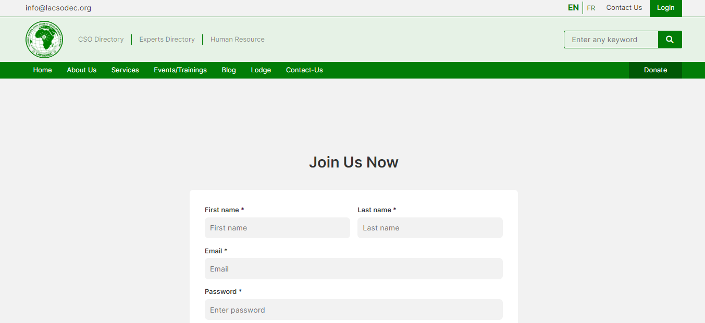

After creating your account, you can log in with your email and password by clicking on the Log In link in the navigation bar.

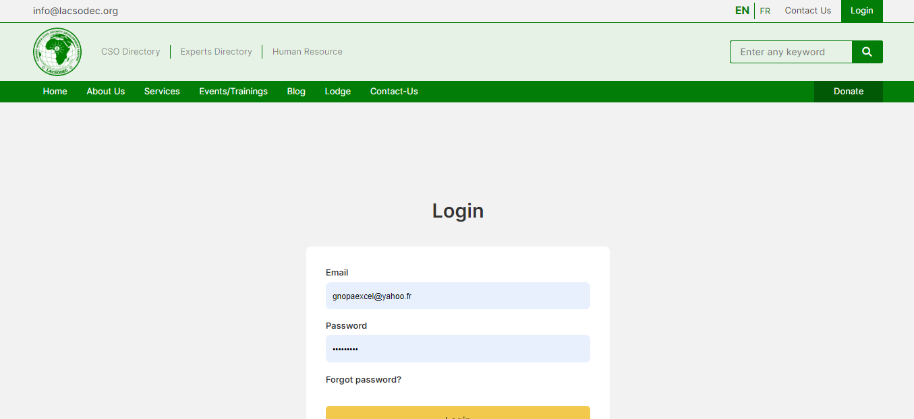

If you forget your password, you can reset it by clicking on the Forgot Password link on the Log In page. This will open a page where you have to enter your email and click on the Send Password Reset Link button. You will receive an email with a link to reset your password.

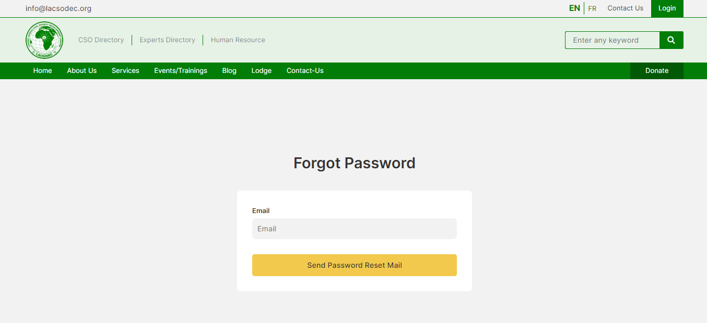

### CSO Registration

If you are a representative of a civil society organization (CSO), you can register your CSO in the website. To register your CSO, you need to log in with your account, navigate to the CSO directory page and click on the Register CSO button.

This will open a page where you have to fill in a form with your CSO's details, such as name, registration, location, description and logo. To submit your registration, click on the Confirm CSO registration button.

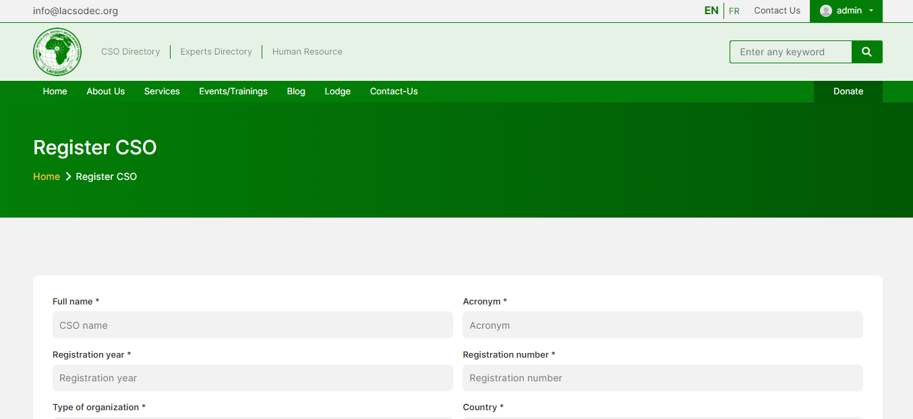

After submitting your registration, you will see a confirmation message that your CSO has been registered and is pending approval.

### Expert Profile Registration

If you are an expert in a certain field or topic, you can register your profile in the website. To register your profile, you need to log in with your account, navigate to the Experts directory page and click on the Register Expert Profile button.

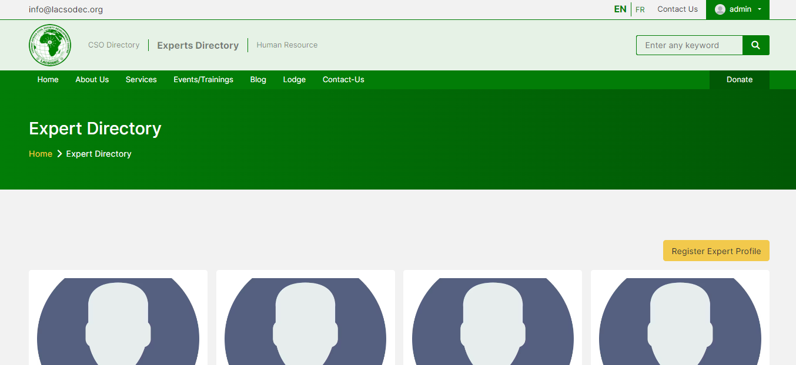

This will open a page where you have to fill in a form with your profile details, such as position, bio, skills, experience and location. To submit your registration, click on the Confirm your Registration button.

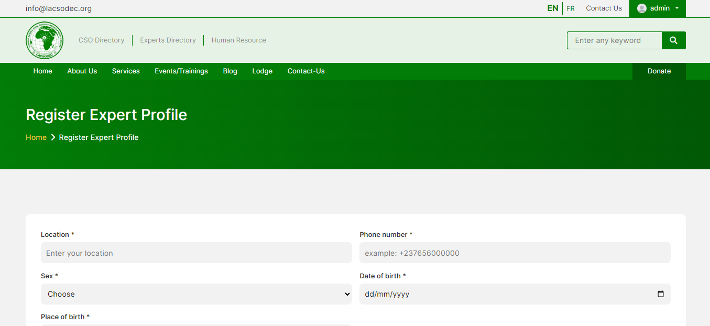
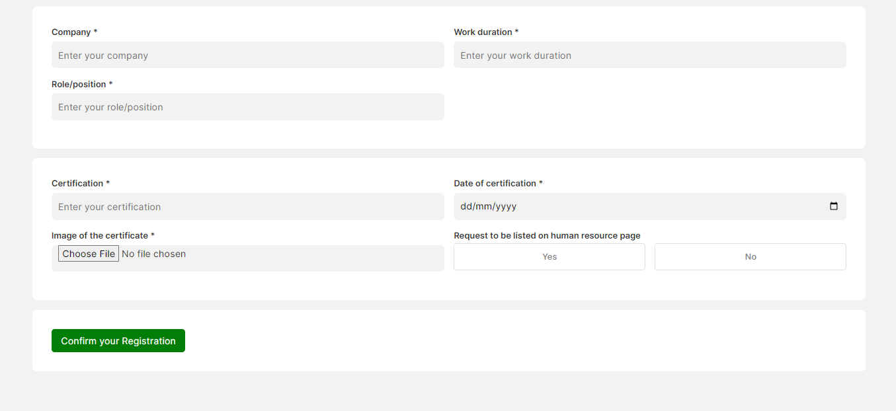

After submitting your registration, you will see a confirmation message that your profile has been registered and is pending approval.

### Blog

The blog feature allows users to read articles on various topics related to civil society and social change. Users can access the blog by clicking on the Blog link in the navigation bar.

On the blog page, you can see a list of the latest articles. You can also use the pagination buttons to navigate through the pages of articles.

To read an article, click on Read more. This will open the article page where you can see the full content, author, date and comments of the article.

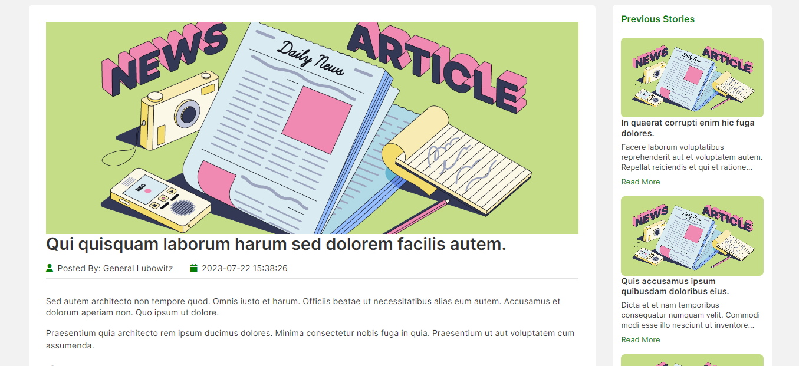

### Events

The events feature allows you to discover and join events related to civil society and social change. You can access the events by clicking on the Events link in the navigation bar.

On the events page, you can see a list of the upcoming events. You can also use the pagination buttons to navigate through the pages of events.

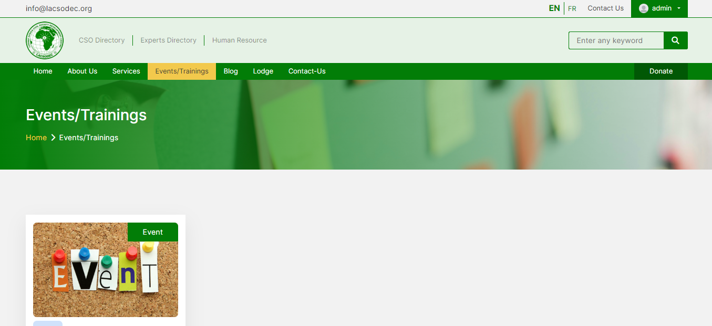

To view an event, click on its title or image. This will open the event page where you can see the type, date, time and description of the event. You can also register for the event by filling out the form in the event's page and clicking on the Confirm Event Participation button.

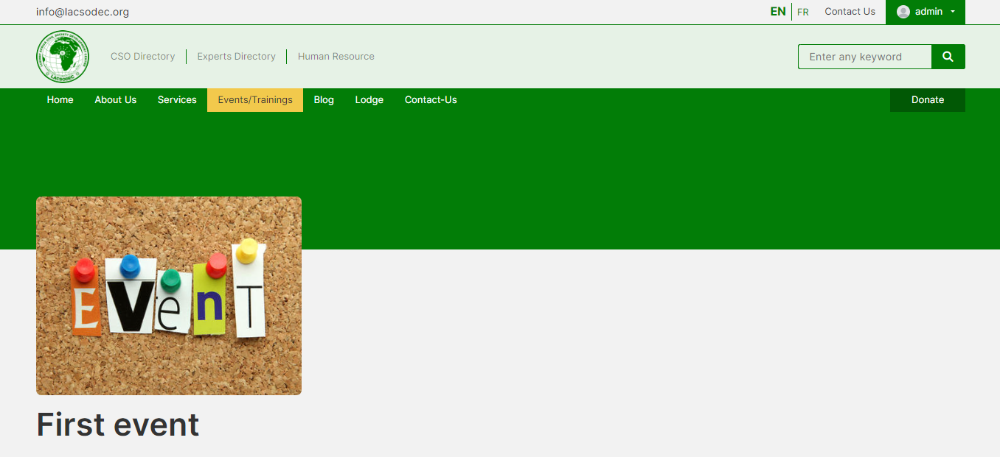
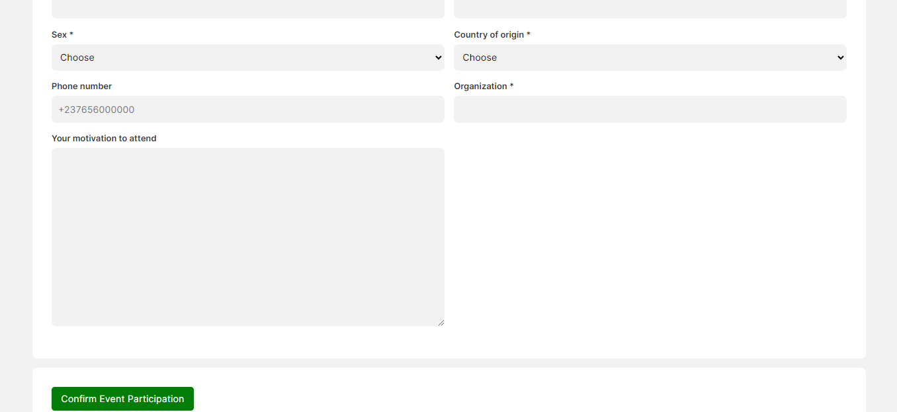
